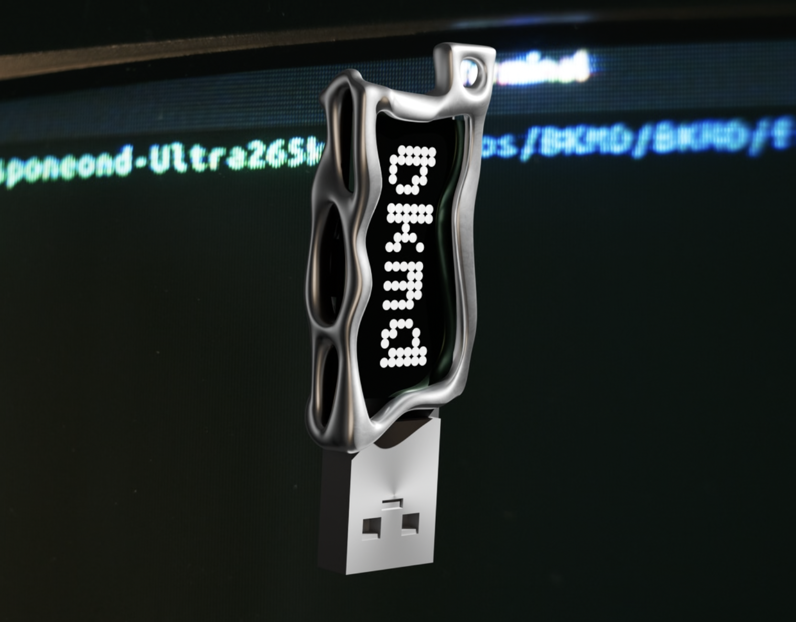
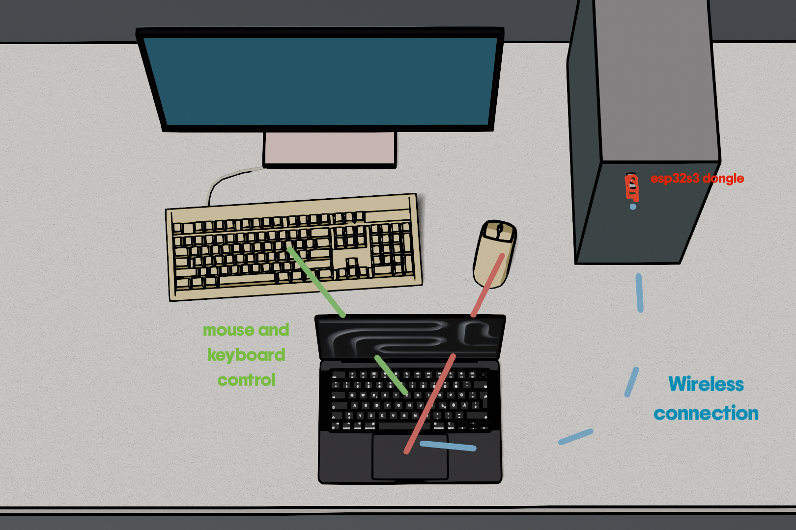
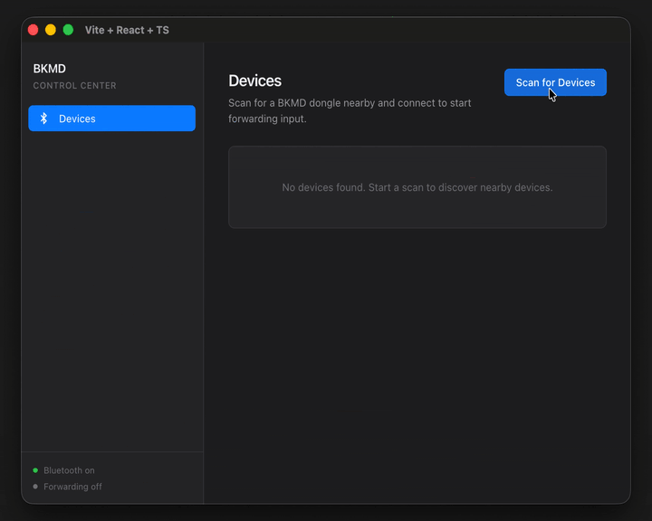

# InterDesk
## Why?
In a world where there's tech for almost every niche problem, there's always an even more niche problem waiting to be solved!

I often work with my laptop and desktop side by side. The problem is that my laptop ends up sitting right in front of the desktop keyboard, so whenever I need to use the other computer, I have to awkwardly reach around it or keep moving between two sets of peripherals.

InterDesk solves that with a tiny wireless USB dongle. Plug the dongle into the computer you want to control and run the companion app on your laptop. Your laptop’s keyboard and touchpad inputs are sent wirelessly over Bluetooth to the dongle, which forwards them as standard USB HID input — meaning no software is required on the controlled device.

That means it can work with everything from your everyday desktop to locked-down school computers, old machines, or any system where installing additional software isn’t an option.




## Features
- Free desktop switching
- Use your laptop's touchpad and keyboard
- **Wireless** control over Bluetooth
- Powered by an esp32s3 == **<5€ solution**
- **No installation on controlled device**
- Keyboard shortcuts for fast switching


## How does it work?

1. Plug the InterDesk dongle into the computer you want to control.
2. Open the InterDesk app on your laptop and connect to the dongle over Bluetooth.
3. Set up or use the activation shortcut to switch input forwarding on and off.
4. When active, the app captures your keyboard and mouse input and converts it into standard HID reports.
5. These reports are sent over Bluetooth to the dongle.
6. The esp32s3 sends the reports directly to the controlled computer over USB.

The controlled computer sees the dongle as a normal USB keyboard and mouse. No InterDesk software or drivers are needed on it.



## Dongle

InterDesk is built around the ESP32-S3 as it gives all we need in small and cheap MCU.

- **Bluetooth Low Energy** to communicate wirelessly with the laptop.
- **Native USB**  so it can act as a USB HID keyboard and mouse.

Our main hardware is **[this dongle](https://www.aliexpress.com/item/1005009024098181.html?spm=a2g0o.detail.0.0.7031xi6bxi6b8k&productId=1005009024098181&pdp_ext_f=%7B%22tabScene%22%3A%22retail%22%2C%22sku_id%22%3A12000047619166787%2C%22origProductId%22%3A%221005009024098181%22%7D#nav-description)** with male USB-A connector for **less then 10euro**. Firmware can also run on other cheaper boards, such as an **ESP32-S3 Zero**, but you need cable. Unfortunatelly we didnt find widely available board with usbc male connector
## App

The InterDesk desktop app is built with **Electron, React and TypeScript** so the same app can run on macOS, Windows and Linux.

The app uses:

* **`uiohook-napi`** to capture global keyboard and mouse input.
* **`@stoprocent/noble`** to scan for the InterDesk dongle, connect over Bluetooth Low Energy and send HID reports.
* **React + Tailwind CSS** for the user interface.

When input forwarding is active, the app captures keyboard and mouse events, converts them into HID reports and sends them to the dongle over BLE.



### Run the app

```bash
cd apps/electron
npm install
npm run dev
```

This starts the React/Vite interface together with Electron in development mode.

### Build

```bash
npm run build
```

Platform-specific packages can also be created with:

```bash
npm run dist:mac
npm run dist:win
npm run dist:linux
```

## Goals
We have many more ideas we want to implement if the project proves useful to others. For example:

- Add a wireless flash drive mode for fast file transfer
- Make switching between computers easier
- Improve speed and latency
- Design a custom PCB with both USB-A and USB-C connectors and a faster esp32s31

This is our first larger project, so we welcome any suggestions or recommendations for improvement.
